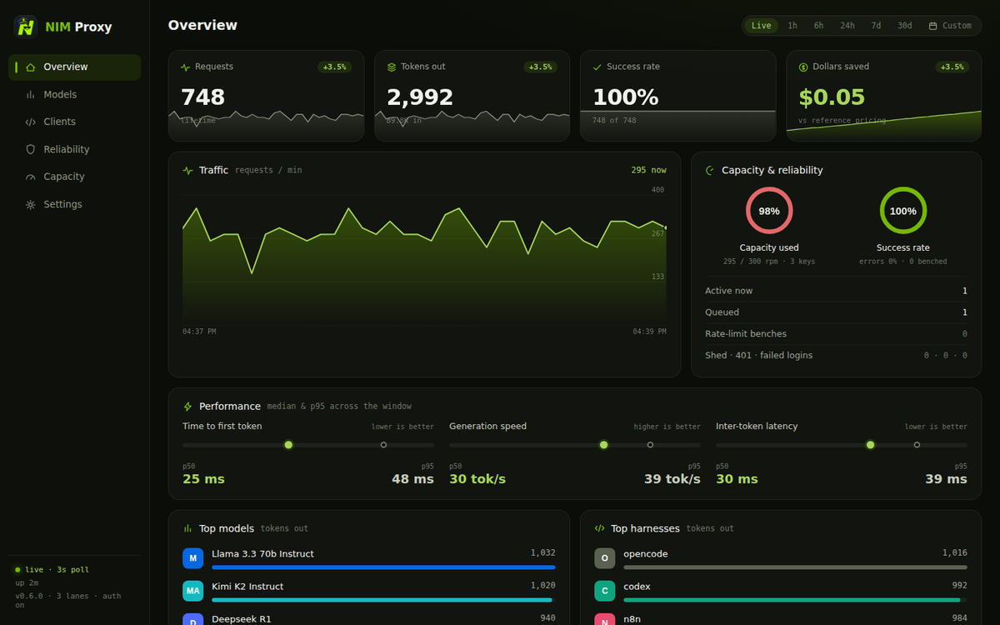
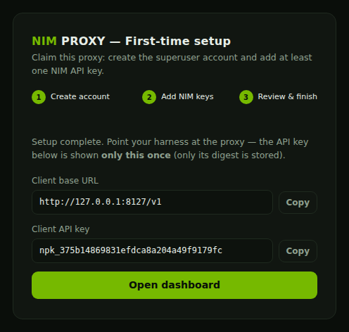
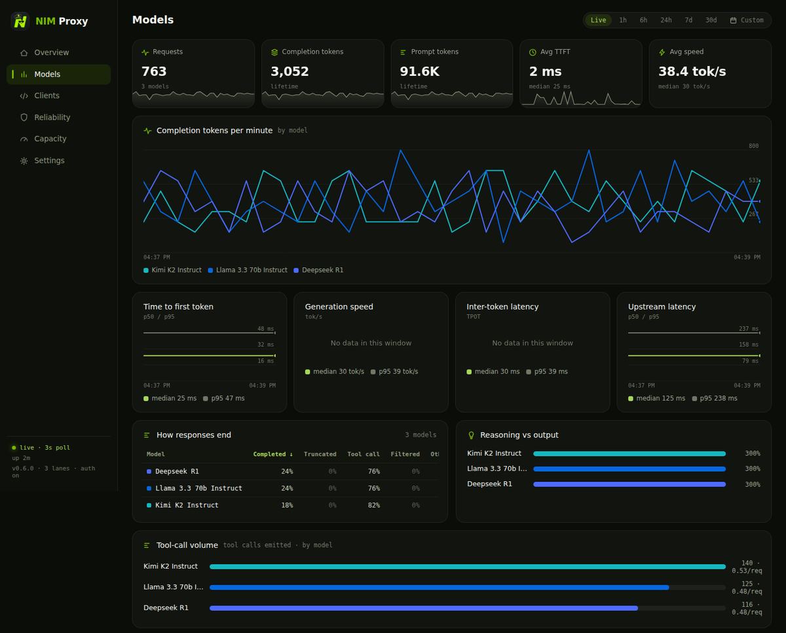
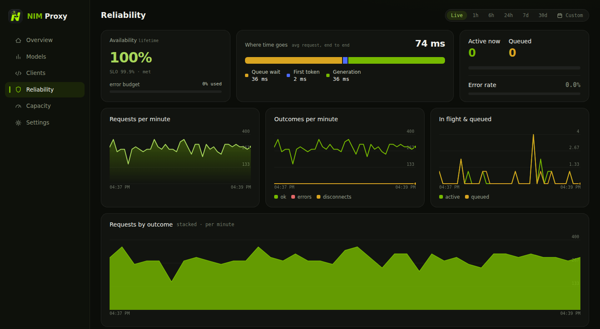
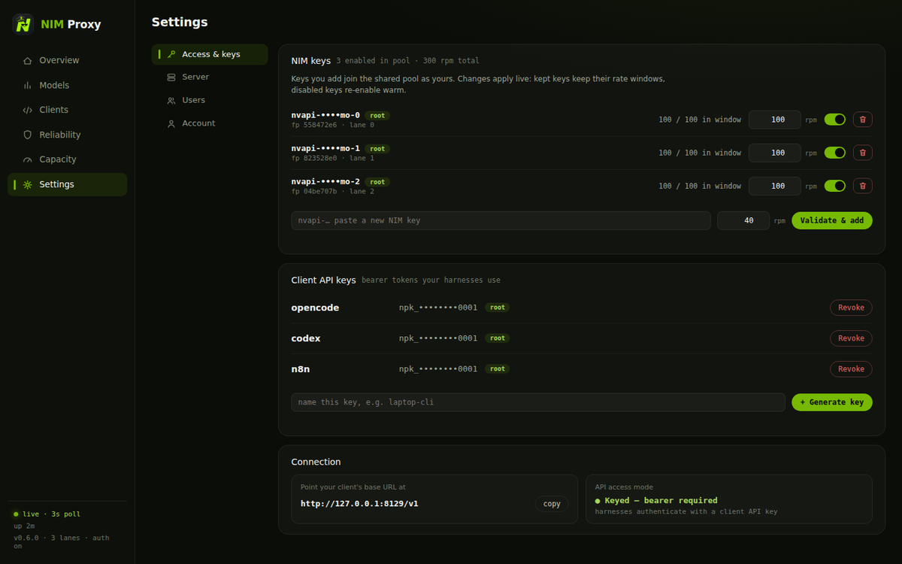

<div align="center">


# nim-proxy

**A tiny, rate-limit-aware OpenAI-compatible proxy for the [NVIDIA NIM API](https://build.nvidia.com).**
One job: obey the NIM speed limit so your agent harness never sees it.

[](https://github.com/miztertea/nim-proxy/actions/workflows/ci.yml)
[](https://github.com/miztertea/nim-proxy/releases/latest)
[](https://scorecard.dev/viewer/?uri=github.com/miztertea/nim-proxy)
[](LICENSE)
[](https://github.com/miztertea/nim-proxy/pkgs/container/nim-proxy)



</div>

---

NIM's free tier has no credits and no token caps — just a ~40 requests-per-minute limit per API key. When an agent harness (OpenCode, Codex, n8n, anything that speaks the OpenAI API) hits that limit, the upstream returns a 429 and most harnesses simply abort the task. nim-proxy sits in between and makes the limit invisible:

```
OpenCode ─┐
Codex     ├──► nim-proxy ──► integrate.api.nvidia.com
n8n       ┘    │
               ├─ paces requests to 40 RPM per key (sliding window)
               ├─ load-balances across all your keys (5 keys = 200 RPM)
               ├─ pins each conversation to one key (prefix-cache affinity)
               ├─ rides out 429/5xx with retries + Retry-After
               ├─ adapts to NIM's per-model worker-concurrency ceiling
               ├─ keeps harness connections alive with SSE heartbeats
               ├─ answers /v1/models from cache (catalog polls cost nothing)
               └─ dashboard + Prometheus metrics for everything above
```

This tool is **not** designed to circumvent NVIDIA's terms of service. It maximizes your own API keys — or a shared pool of keys owned by you and your friends — while *respecting* NVIDIA's speed limits. Every key holds to its 40 RPM; the proxy just makes agents patient enough to live within that budget. Load-tested to prove it: 100 concurrent clients, zero upstream rate violations.

## Quick start

**1. Get API keys.** Sign up at [build.nvidia.com](https://build.nvidia.com) (free, keys look like `nvapi-…`; each account needs a unique email and phone number). You'll paste keys into the setup wizard — never into a file.

**2. Run the proxy.** The published image is multi-arch, signed, and ~5 MB, with hardened defaults and persistent history:

```sh
docker run -d --name nim-proxy -p 127.0.0.1:8000:8000 -v nim-proxy-data:/data \
  ghcr.io/miztertea/nim-proxy:latest
```

With a checkout you can use compose (`docker compose up -d`), build from source (`docker compose -f docker-compose.yml -f docker-compose.dev.yml up -d --build`), or skip Docker entirely (`cargo run --release`). The `.env` file is optional and holds only container-level vars — see [Configuration](#configuration).

```
     _  _ ___ __  __   ___ ___  _____  ____   __
    | \| |_ _|  \/  | | _ \ _ \/ _ \ \/ /\ \ / /
    | .` || || |\/| | |  _/   / (_) >  <  \ V /
    |_|\_|___|_|  |_| |_| |_|_\\___/_/\_\  |_|
```

**3. Claim it.** Open `http://localhost:8000/` — a fresh install runs the **first-run wizard**: create the superuser account, add at least one NIM key (validated live against the upstream), and finish. By default the wizard also mints your first **client API key** (`npk_…`) and ends on a connect panel with the base URL and key ready to copy — so your harness works immediately.

<div align="center"></div>

> **The first visitor to a fresh install becomes the superuser** — finish the wizard as soon as the proxy is reachable (the boot log says so too). Until setup completes, `/v1` is closed (503) and browsers are sent to `/setup`.

**4. Point your harness at it.** Base URL `http://localhost:8000/v1`, API key = the `npk_…` key from the wizard. Recipes below.

## Client recipes

Model IDs pass through verbatim — use any ID from the [NIM catalog](https://build.nvidia.com/models) (or `curl localhost:8000/v1/models`). In `keyed` mode (the default) clients authenticate with a client API key (`npk_…`) minted in the wizard or in Settings; in `open` mode no client key is needed.

**OpenCode** — `opencode.json`:

```json
{
  "$schema": "https://opencode.ai/config.json",
  "provider": {
    "nim": {
      "npm": "@ai-sdk/openai-compatible",
      "name": "NVIDIA NIM (proxied)",
      "options": {
        "baseURL": "http://localhost:8000/v1",
        "apiKey": "npk_your-key-here",
        "timeout": false
      },
      "models": {
        "moonshotai/kimi-k2-instruct": { "name": "Kimi K2 Instruct" },
        "deepseek-ai/deepseek-r1": { "name": "DeepSeek R1" }
      }
    }
  }
}
```

Set `options.timeout: false` so OpenCode waits through the proxy's rate-limit heartbeats instead of aborting. For a complete config tuned for **GLM-5.2** (context, compaction, sampling), copy [`examples/opencode.json`](examples/opencode.json) — see [`examples/README.md`](examples/README.md) for the rationale behind each setting.

**Codex CLI** — `~/.codex/config.toml`:

```toml
model_provider = "nim"
model = "moonshotai/kimi-k2-instruct"

[model_providers.nim]
name = "NVIDIA NIM (proxied)"
base_url = "http://localhost:8000/v1"
env_key = "NIM_PROXY_API_KEY"   # export NIM_PROXY_API_KEY=npk_your-key-here
wire_api = "chat"
```

**n8n** — add an *OpenAI* credential with Base URL `http://localhost:8000/v1` and your `npk_…` key, then use it in AI nodes with a NIM model ID.

**Plain curl**:

```sh
curl http://localhost:8000/v1/chat/completions \
  -H 'Content-Type: application/json' \
  -H 'Authorization: Bearer npk_your-key-here' \
  -d '{"model":"deepseek-ai/deepseek-r1","stream":true,
       "messages":[{"role":"user","content":"hello"}]}'
```

## The dashboard

Served at `GET /` — a single embedded HTML file, no Grafana, no config. Because the proxy sits in the request path for every harness and model, it doubles as a **benchmarking and agent-observability tool**: it sees how tool-heavy each harness is, how deep its conversations run, how it tunes sampling, where models truncate, and how much "thinking" a reasoning model burns — all from counts and sizes, never message content.

<div align="center"></div>

Five persona-aligned tabs, each ordered at-a-glance → trends → detail:

- **Overview** — the one-screen landing: dollars saved, capacity and success-rate ring gauges, request/token/savings sparklines, a health strip, and top models & harnesses.
- **Models** — ranked model cards, TTFT / generation-speed / inter-token-latency / upstream-latency charts, tokens-per-minute, tool-call volume, truncation and reasoning-share breakdowns, and a head-to-head scorecard.
- **Clients** — what each agent is *doing*: tool intensity, conversation depth, sampling fingerprint, requested output budget, streaming-vs-buffered mix, and a per-harness leaderboard.
- **Reliability** — availability against a 99.9% SLO with an error budget, requests-by-outcome over time, where time goes (queue / first token / generation), an error taxonomy, an hour-of-day heatmap, and a model-pressure card when the governor engages.
- **Capacity** — a saturation bar (load vs aggregate capacity with a peak marker), a provisioning readout that flags when you're a key short, per-lane utilization meters, and 429s-per-minute by lane.

<div align="center"></div>

Every line chart has a hover crosshair with a per-series tooltip; every table is click-to-sort and survives the 3-second live refresh.

**Time ranges & history.** The filter row offers Live (pausable) plus 1h/6h/24h/7d/30d presets and a custom calendar range. Range views replay the proxy's own history: a ~4 KB metrics snapshot every 5 minutes, kept for the retention window set in Settings (default 30 days, `0` = forever; ~35 MB per 30 days on the data volume). In a range view every tile, card, and table reports totals *for that window* — instant usage reports.

**Settings.** Everything app-level is managed here, live, with no restart: NIM keys (per-key rpm, enable/disable), client API keys, the open/keyed API mode, upstream URL, limits, pricing, history retention, the model-pressure governor, and users.

<div align="center"></div>

## How it works

- **One lane per key.** Each API key gets an exact sliding-window limiter (40 requests per rolling 60 s — matching NIM's limiter, not a burstable token bucket — plus a 1 s jitter margin so boundary-timed requests can't land inside the upstream's window).
- **One queue for all clients.** Any number of harnesses share the lane pool through a global FIFO dispatcher: slots are granted strictly in arrival order, no client can starve another, and a client that disconnects while queued returns its slot.
- **Sticky conversations, spread bursts.** Each conversation prefers the same lane every turn, keeping any server-side [prefix cache](https://docs.nvidia.com/nim/large-language-models/latest/kv-cache-reuse.html) warm on one key. When that lane is full the request spills to the least-loaded ready lane — the API is stateless, so crossing keys is always safe, just potentially a cold cache.
- **Heartbeats instead of failures.** For streaming requests the proxy commits to `200 text/event-stream` immediately and emits SSE comment lines (`: heartbeat` — ignored by every OpenAI client) while it waits for a slot or rides out upstream 429/500/502/503/504 with `Retry-After` honored and instant failover between keys. Streams that stall mid-generation are cut after the `stream_idle` limit.
- **Model-pressure aware.** NIM caps per-model worker concurrency independently of the 40 RPM key limit; the proxy detects that specific exhaustion, backs off the affected *model* adaptively (never wasting healthy key capacity on failover), and surfaces it on the dashboard — see [architecture: governor](knowledge/architecture/governor.md).
- **Pass-through with one exception.** Bodies are forwarded untouched, except: streaming chat requests get `stream_options: {"include_usage": true}` injected so token accounting is exact rather than estimated. If a model rejects the field, the proxy retries untouched and never injects for that model again. `strict_passthrough` in Settings disables injection entirely.
- **Local answers where possible.** `GET /v1/models` is cached (10 min default, single-flight refresh), so harness catalog polls don't burn rate budget.

## Configuration

App-level configuration lives in the dashboard (Settings) and persists to `DATA_DIR/config.json`. It applies live — no restarts. Environment variables cover container-level concerns only:

| Variable | Default | Purpose |
|---|---|---|
| `HOST` / `PORT` | `0.0.0.0` / `8000` | Bind address and port |
| `DATA_DIR` | `data` (`/data` in Docker) | Where the config store and `history.jsonl` live; must be writable (an unwritable dir is a hard boot error) |
| `TRUST_PROXY` | `false` | Trust `X-Forwarded-Proto` and mark the session cookie `Secure` (set behind a TLS-terminating reverse proxy) |
| `RUST_LOG` | `nim_proxy=info` | Log filter |

Everything else is a Settings control: NIM keys (per-key rpm, enable/disable, ownership), the upstream base URL, client API keys and the open/keyed API mode, limits (`max_wait`, `heartbeat`, `stream_idle`, `request_timeout`, `models_ttl`, `max_inflight`, `strict_passthrough`), reference pricing, history retention, the model-pressure governor, and users & roles.

## Security & deployment

The proxy **fails closed**. Before setup, the data plane is closed (`/v1` → `503 setup_required`) and browsers are sent to the wizard. After setup, the dashboard and all observability **always** require a logged-in user; the `/v1` API is either `keyed` or `open` (a Settings toggle). Credentials live in the config store on the data volume (`config.json`, mode 0600) — not in env vars.

### Users & roles

The wizard creates the **superuser** — an admin that can never be deleted (so the last admin can't vanish). From Settings → Users, admins add more users:

- **superuser** — an admin; the one account that can't be deleted, and it always owns ≥1 enabled NIM key (the pool floor).
- **admin** — server settings + user management.
- **user** — own account, own client API keys, own NIM keys. Sees every dashboard tab (identical for all roles) but only their own key rows.

That last role is the shared-pool model: a friend adds their NIM key to the pool and mints their own client key; nobody else — not even an admin — can ever see either value.

Login is username + password → a signed, HttpOnly, SameSite=Strict session cookie. Changing or resetting a password logs that user's other sessions out instantly; deleting a user kills their sessions, pulls their NIM keys from the pool, and revokes their client keys. Passwords are PBKDF2-HMAC-SHA256 (600k iterations). Forgot a password? Any admin resets it (except the superuser's — that one only rotates via its own Account page). Locked out entirely? Stop the container, empty the `"users"` array in `config.json` on the volume, restart — the wizard re-creates the superuser and keys/settings survive.

### The `/v1` API: keyed or open

- **`keyed`** (default) — clients send `Authorization: Bearer <npk_…>`. Each user mints their own client keys; a key's 128-bit secret is shown **exactly once** (only its SHA-256 digest + last-4 are stored). Keyed with zero keys rejects everything (fail closed). Unknown keys get an OpenAI-style 401; comparison is constant-time.
- **`open`** — `/v1` is unauthenticated. Only for loopback or a fully private network. This toggle affects **only `/v1`** — the dashboard is never open.

The compose file publishes `127.0.0.1:8000:8000` by default so a bare bring-up can't leak.

### Scrapers

Prometheus scrapes `/metrics` with `Authorization: Bearer <username>:<password>` (or HTTP Basic) for any dashboard user:

```yaml
scrape_configs:
  - job_name: nim-proxy
    authorization: { credentials: "<username>:<password>" }
    static_configs: [{ targets: ["nim-proxy:8000"] }]
```

`/health` stays public (load-balancer / Docker probe; exposes nothing).

### Deployment patterns

| Pattern | How |
|---|---|
| **Local self-host** | Keep the default loopback port publish; switch the API mode to `open` in Settings if you don't want client keys. |
| **VPS / bare metal** | A TLS-terminating reverse proxy (nginx/Caddy) in front; keep the API `keyed`. Set `TRUST_PROXY=true` so the session cookie is marked `Secure`. |
| **PaaS (ECS / Railway / Fly)** | The platform edge terminates TLS. Set `TRUST_PROXY=true`. Complete the wizard as soon as the instance is reachable. |

**TLS is not built in** — passwords and keys must travel over HTTPS, so terminate TLS at a reverse proxy or platform edge for any exposed deployment. Additional hardening in place: a strict `Content-Security-Policy` and anti-framing/sniffing headers on all responses, a failed-login throttle, and an in-flight cap (`max_inflight`) that sheds floods with a 503.

## Operations

- **Image**: built `FROM scratch` — a ~5 MB static musl binary with TLS roots compiled in. No shell, no libc, no CA bundle. Runs as a non-root UID with `read_only`, `cap_drop: ALL`, `no-new-privileges`; rootless Docker/Podman compatible.
- **Healthcheck**: the binary doubles as its own probe (`nim-proxy --health`); `docker ps` shows `healthy`.
- **Logs**: the ASCII banner + structured startup detail, then one access line per request (`200 alice model /v1/chat/completions (3210 ms)`). ANSI color is TTY-detected, so `docker logs` stays clean.
- **Metrics**: Prometheus exposition at `GET /metrics` (scrapeable by any OTel collector's Prometheus receiver). Full series list below.
- **Shutdown**: SIGTERM and SIGINT both drain gracefully.

<details>
<summary><b>Full metric reference</b> (click to expand)</summary>

| Metric | Labels | Meaning |
|---|---|---|
| `nimproxy_requests_total` | client, model, path, status | Every request (`status` includes `disconnect`, `stall`, `stream_error`) |
| `nimproxy_prompt_tokens_total` | client, model | Prompt tokens, from upstream `usage` |
| `nimproxy_completion_tokens_total` | client, model, source | Completion tokens; `usage` = exact, `estimate` = per-SSE-event fallback |
| `nimproxy_ttft_seconds` | model | Upstream send → first streamed byte |
| `nimproxy_tokens_per_second` | model, source | Generation speed |
| `nimproxy_tpot_seconds` | model | Mean inter-token latency (time per output token) |
| `nimproxy_upstream_seconds` | model | Upstream latency (streaming + non-streaming) |
| `nimproxy_finish_reason_total` | model, reason | How generations end; `length` = truncation |
| `nimproxy_tool_calls_total` | model | Tool calls emitted |
| `nimproxy_reasoning_tokens_total` | model | Reasoning ("thinking") tokens, from `usage` details |
| `nimproxy_stream_requests_total` | client, stream | Requests per harness, streaming vs buffered |
| `nimproxy_request_messages` | client | Conversation depth per request (histogram) |
| `nimproxy_request_tools` | client | Tools offered per request (histogram) |
| `nimproxy_request_max_tokens` | client | Requested output cap (histogram) |
| `nimproxy_request_temperature` | client | Sampling temperature (histogram) |
| `nimproxy_tool_choice_total` | mode | Tool-selection mode: `auto`/`none`/`required`/`named` |
| `nimproxy_json_mode_total` | client | Structured-output (JSON-mode) requests |
| `nimproxy_queue_wait_seconds` | — | Time waiting for a rate-limit slot |
| `nimproxy_queue_depth` / `nimproxy_active_requests` | — | Live load gauges |
| `nimproxy_lane_requests_total` | lane | Requests per key lane |
| `nimproxy_lane_benched_total` | lane, status | Upstream 429/5xx/connect per lane |
| `nimproxy_affinity_total` | result | Conversation routing: `sticky` / `spill` / `none` |
| `nimproxy_unauthorized_total` | — | Rejected API requests |
| `nimproxy_login_failures_total` | — | Failed dashboard logins |
| `nimproxy_shed_total` | — | Requests shed at the in-flight cap |
| `nimproxy_worker_exhausted_total` | model | NIM per-model worker-concurrency exhaustion events |
| `nimproxy_model_inflight` | model | Requests in flight per model (governor gauge) |
| `nimproxy_model_limit` | model | Current per-model concurrency cap; `0` = ungoverned |

Request shape (messages, tools, sampling params) is captured as **counts and sizes only — never message content**. The `model` and `path` labels are sanitized (safe charset, length-capped) and `model` cardinality is bounded; `reason`, `mode`, and `stream` are fixed enums — so untrusted clients can't inject into the exposition format or explode the registry.

</details>

## Testing

Three layers, all runnable locally:

```sh
cargo test          # unit + end-to-end tests (real binary vs a scripted mock NIM)
```

The e2e suite covers auth (client keys, multi-user login, role and ownership enforcement, the fail-closed setup posture and the wizard), the config store (round-trip across restart, atomic saves, refusal on corrupt/future-version stores), 429 ride-out with key failover, per-model worker-exhaustion governing, Retry-After timing, pacing enforcement (including live pool rebuilds mid-run), conversation affinity, models caching, usage injection, stalled-stream recovery, label-injection sanitizing, security headers, metrics accuracy, history persistence across restart, and SIGTERM.

Load test — 100 concurrent clients against a mock that *strictly enforces* NIM's per-key window and counts violations (`--worker-slots` also emits NIM's real per-model worker-exhaustion error so the governor is exercised):

```sh
python3 scripts/mock_nim.py --enforce --rpm 40 --worker-slots 32 --port 9999 &
cargo run --release &     # complete the wizard against http://127.0.0.1:9999
python3 scripts/loadtest.py --clients 100 --requests 3
```

It exits non-zero on any client-visible failure or a single upstream rate violation, and reports worker exhaustions + peak per-model concurrency. See [`knowledge/testing/test-strategy.md`](knowledge/testing/test-strategy.md) for the full strategy and [CONTRIBUTING.md](CONTRIBUTING.md) for the development workflow.

## FAQ & limitations

- **Is this against NVIDIA's ToS? It's designed not to be.** The proxy never exceeds any key's rate limit — that's its entire purpose. Keys are issued per developer account; whether you pool keys with friends is between you and [NVIDIA's terms](https://www.nvidia.com/en-us/agreements/) — the proxy just guarantees each key behaves.
- **Non-streaming requests can't be heartbeated** (no wire format for it) — they wait silently through pacing/retries up to the `max_wait` limit. Agent harnesses stream, so this rarely matters.
- **One instance per key set.** Rate state is in-memory; two replicas sharing keys would each assume the full 40 RPM. Run one instance (it comfortably saturates far more keys than you can register).
- **Rate windows reset on restart.** A restart right after heavy traffic can draw a burst of 429s — the retry machinery absorbs them invisibly.
- **Chart history in a Live view lives in the browser** (~20 min); range views and totals come from server-side history and survive refresh.
- **"OTel metrics?"** Prometheus exposition format, which every OpenTelemetry collector ingests natively (`prometheus` receiver).
- **No built-in TLS.** Terminate TLS at a reverse proxy or platform edge for any exposed deployment; set `TRUST_PROXY=true` so session cookies are marked `Secure`.
- **Sessions reset on restart.** The cookie signing key is random per boot, so a restart logs everyone out of the dashboard (API keys are unaffected).

## Project knowledge base

The `knowledge/` directory holds the project's long-term memory — design decisions with their reasoning, validated research about NIM, per-component architecture notes, and runbooks, all cross-linked markdown. Start at [`knowledge/index.md`](knowledge/index.md). [`AGENTS.md`](AGENTS.md) tells AI agents how to maintain it.

## License

MIT — see [LICENSE](LICENSE).
